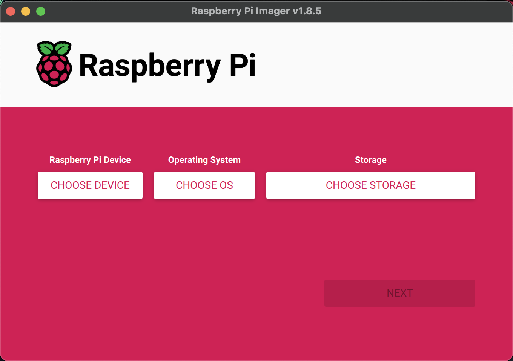
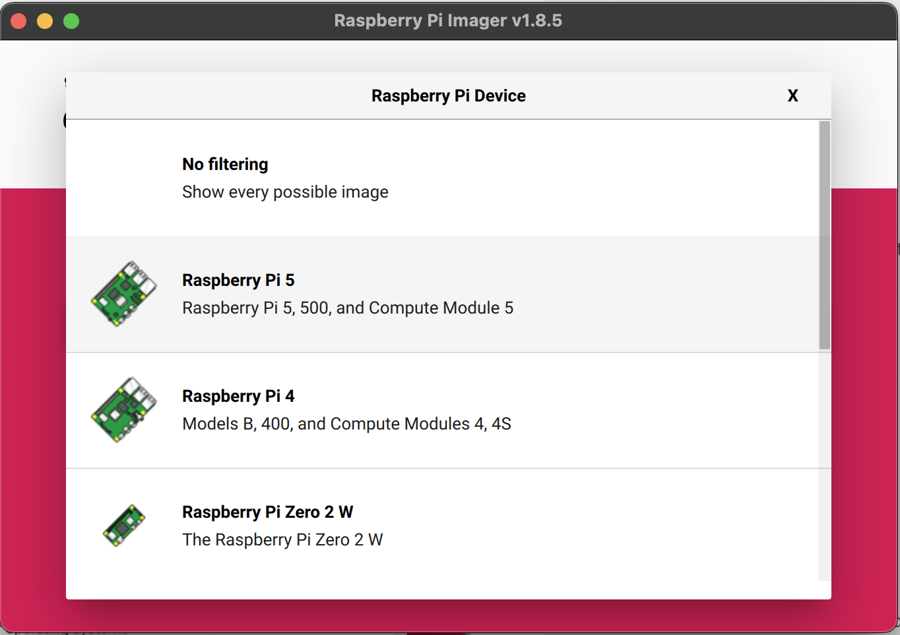
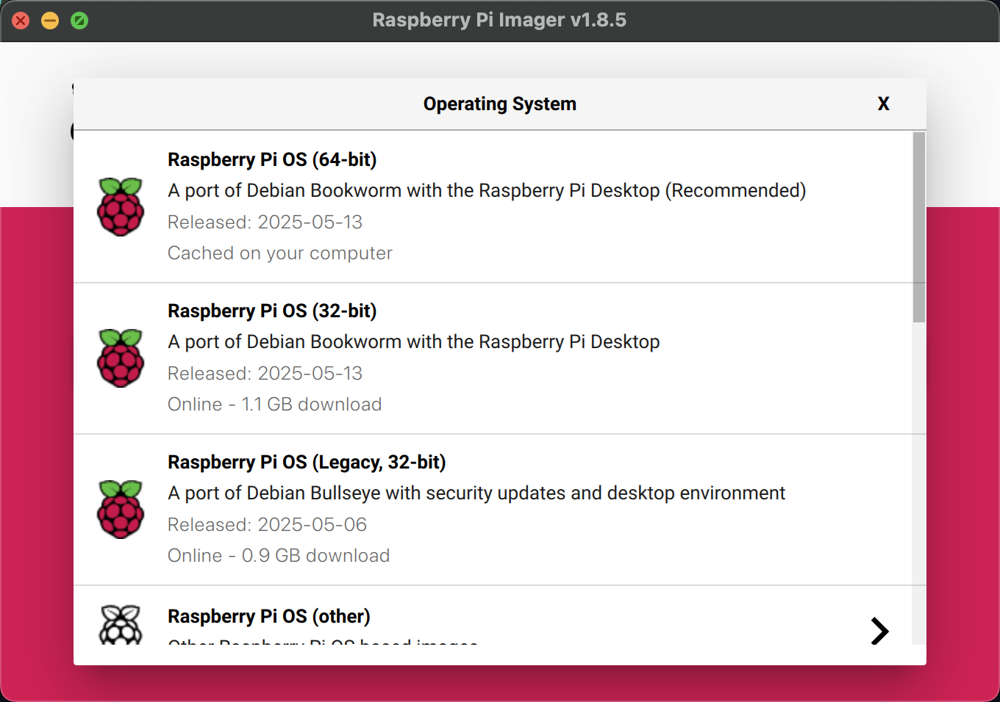
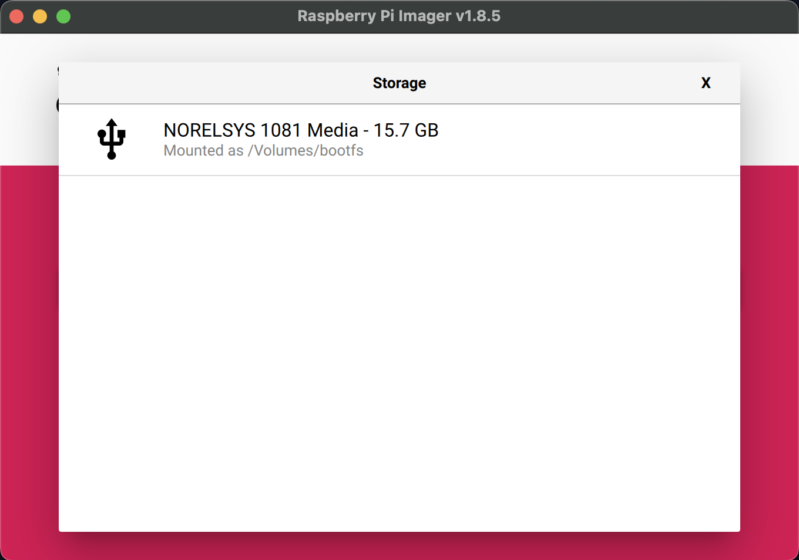
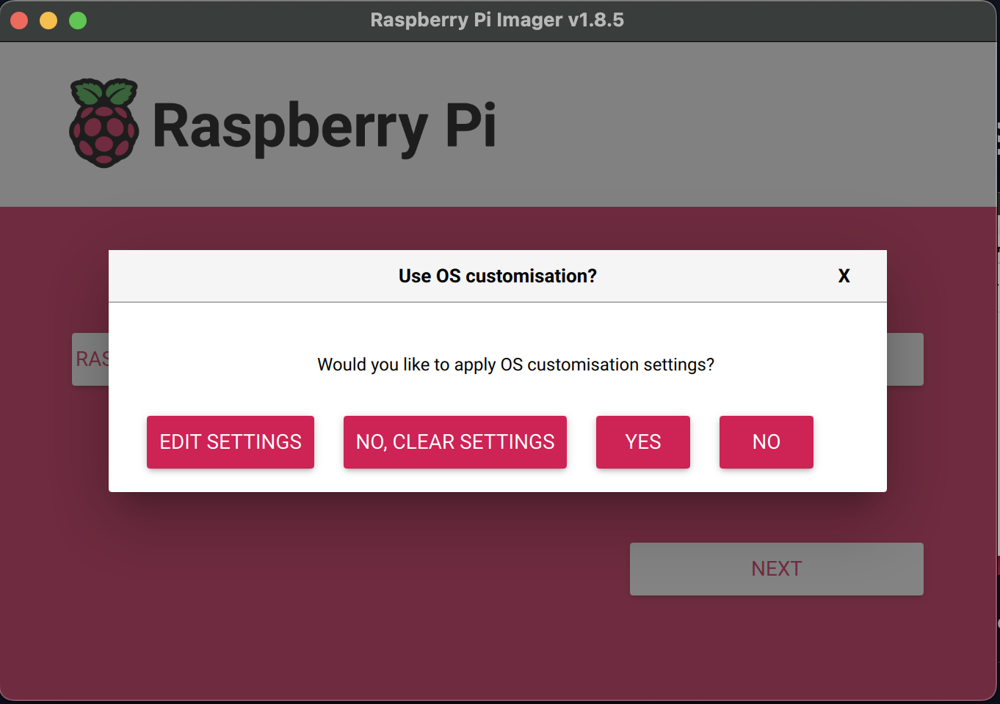
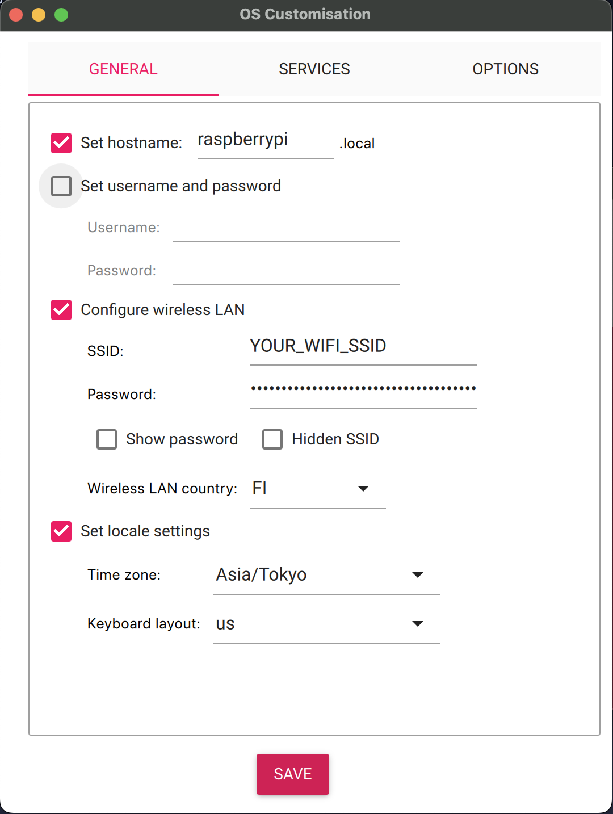
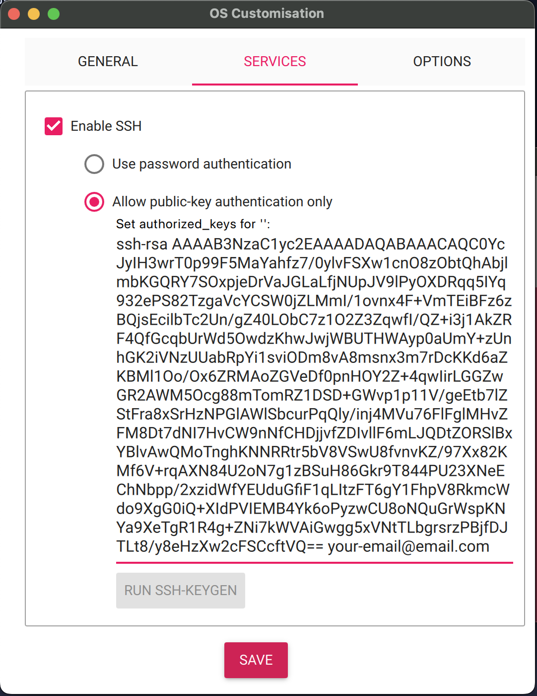
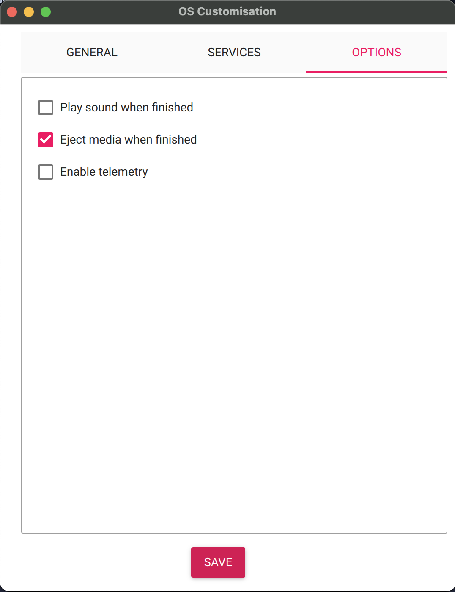

# Raspberry Pi OS Imager

Use the Raspberry Pi Imager to write the image to your SD card.  
You can download it from [the official Raspberry Pi website](https://www.raspberrypi.org/software/).

## Steps

### 1. **Open the Raspberry Pi Imager**  

### 2. **Select the Device**  

 
*Raspberry Pi Zero 2 W*

### 3. **Select the OS**  

  
*Raspberry Pi OS (64-bit)*

### 4. **Select the Storage**  

Plug the SD Card into the card reader and select it from the list.

### 5. **Edit the Settings**  
After selecting the device, OS, and storage, click the **Next** button. Edit the settings.

  

Make sure to enter your **PUBLIC** key in the "SSH" section (do **not** add your private key). This will allow you to access the Raspberry Pi Zero 2 W via SSH without a password.

Once you have edited the settings, click the **Save** button.

### 6. **Write the Image**  
Click through the remaining dialogs to start writing the image to the SD card. When it is complete, remove the SD card 
from the card reader and insert it into the Raspberry Pi Zero 2 W.

### 7. **Start the Raspberry Pi Zero 2 W**  
Connect the Raspberry Pi Zero 2 W to a power source or your computer and wait for it to boot up. It should connect to 
your Wi-Fi network automatically. The address should be `raspberrypi.local` (or whatever hostname you set) or the IP 
address assigned by your router. You can now access it via SSH.